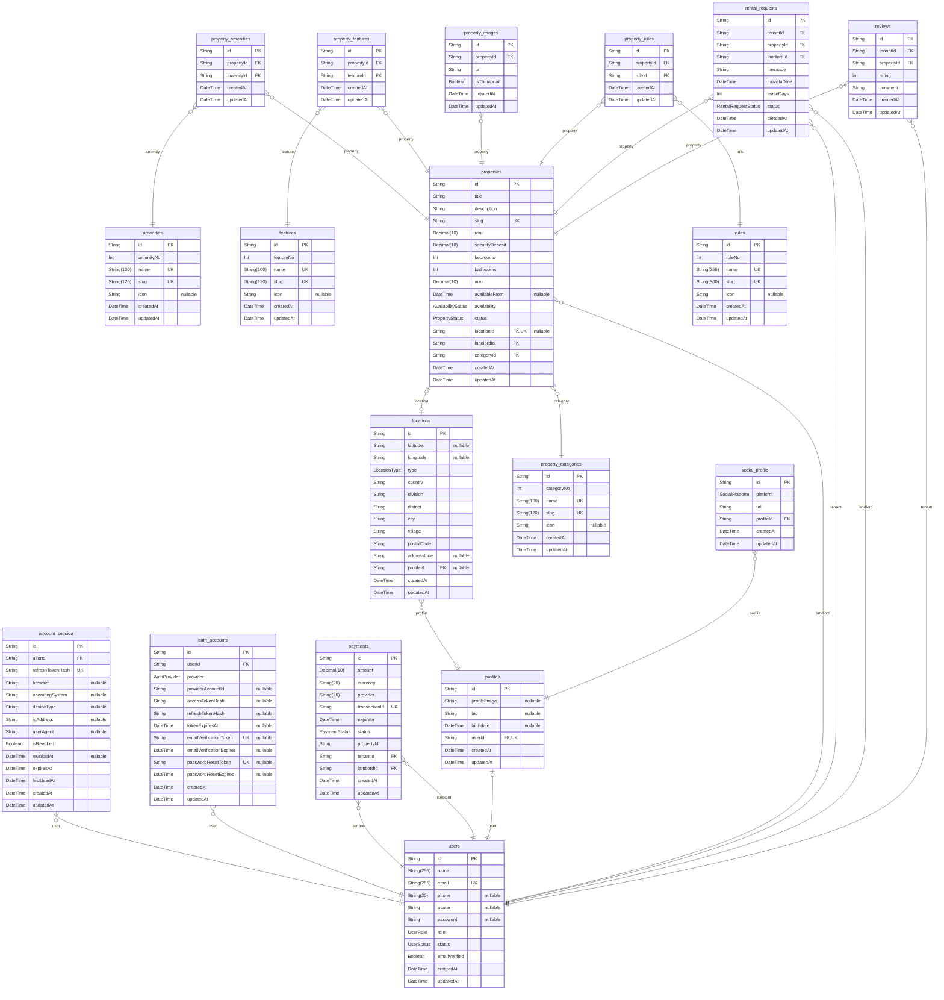

# Prisma Markdown

### `account_session`

Properties as follows:

- `id`:
- `userId`:
- `refreshTokenHash`:
- `browser`:
- `operatingSystem`:
- `deviceType`:
- `ipAddress`:
- `userAgent`:
- `isRevoked`:
- `revokedAt`:
- `expiresAt`:
- `lastUsedAt`:
- `createdAt`:
- `updatedAt`:

### `amenities`

Properties as follows:

- `id`:
- `amenityNo`:
- `name`:
- `slug`:
- `icon`:
- `createdAt`:
- `updatedAt`:

### `auth_accounts`

Properties as follows:

- `id`:
- `userId`:
- `provider`:
- `providerAccountId`:
- `accessTokenHash`:
- `refreshTokenHash`:
- `tokenExpiresAt`:
- `emailVerificationToken`:
- `emailVerificationExpires`:
- `passwordResetToken`:
- `passwordResetExpires`:
- `createdAt`:
- `updatedAt`:

### `features`

Properties as follows:

- `id`:
- `featureNo`:
- `name`:
- `slug`:
- `icon`:
- `createdAt`:
- `updatedAt`:

### `locations`

Properties as follows:

- `id`:
- `latitude`:
- `longitude`:
- `type`:
- `country`:
- `division`:
- `district`:
- `city`:
- `village`:
- `postalCode`:
- `addressLine`:
- `profileId`:
- `createdAt`:
- `updatedAt`:

### `payments`

Properties as follows:

- `id`:
- `amount`:
- `currency`:
- `provider`:
- `transactionId`:
- `expireIn`:
- `status`:
- `propertyId`:
- `tenantId`:
- `landlordId`:
- `createdAt`:
- `updatedAt`:

### `profiles`

Properties as follows:

- `id`:
- `profileImage`:
- `bio`:
- `birthdate`:
- `userId`:
- `createdAt`:
- `updatedAt`:

### `properties`

Properties as follows:

- `id`:
- `title`:
- `description`:
- `slug`:
- `rent`:
- `securityDeposit`:
- `bedrooms`:
- `bathrooms`:
- `area`:
- `availableFrom`:
- `availability`:
- `status`:
- `locationId`:
- `landlordId`:
- `categoryId`:
- `createdAt`:
- `updatedAt`:

### `property_amenities`

Properties as follows:

- `id`:
- `propertyId`:
- `amenityId`:
- `createdAt`:
- `updatedAt`:

### `property_categories`

Properties as follows:

- `id`:
- `categoryNo`:
- `name`:
- `slug`:
- `icon`:
- `createdAt`:
- `updatedAt`:

### `property_features`

Properties as follows:

- `id`:
- `propertyId`:
- `featureId`:
- `createdAt`:
- `updatedAt`:

### `property_images`

Properties as follows:

- `id`:
- `propertyId`:
- `url`:
- `isThumbnail`:
- `createdAt`:
- `updatedAt`:

### `property_rules`

Properties as follows:

- `id`:
- `propertyId`:
- `ruleId`:
- `createdAt`:
- `updatedAt`:

### `rental_requests`

Properties as follows:

- `id`:
- `tenantId`:
- `propertyId`:
- `landlordId`:
- `message`:
- `moveInDate`:
- `leaseDays`:
- `status`:
- `createdAt`:
- `updatedAt`:

### `reviews`

Properties as follows:

- `id`:
- `tenantId`:
- `propertyId`:
- `rating`:
- `comment`:
- `createdAt`:
- `updatedAt`:

### `rules`

Properties as follows:

- `id`:
- `ruleNo`:
- `name`:
- `slug`:
- `icon`:
- `createdAt`:
- `updatedAt`:

### `social_profile`

Properties as follows:

- `id`:
- `platform`:
- `url`:
- `profileId`:
- `createdAt`:
- `updatedAt`:

### `users`

Properties as follows:

- `id`:
- `name`:
- `email`:
- `phone`:
- `avatar`:
- `password`:
- `role`:
- `status`:
- `emailVerified`:
- `createdAt`:
- `updatedAt`:
